# UT1 - A1 : Mis series favoritas.

En esta actividad he creado una página web que enlaza con mis 5 series favoritas.

## 1. Creación Del Directorio Series.

Supongamos que queremos mostrar una página web que hemos creado en la carpeta home del usuario alu5904. Además queremos añadir un nuevo host que se llame series, que cuando se acceda a alu5905.me/series nos musetre la web que vamos a diseñar en el direcctorio /home/alu5904/webapps/series.Dicha página web además queremos que se muestre en esa página nuestras 5 series favoritas

Añadimos el fichero de configuración de Nginx que tratará las peticiones que se hagan al nombre de dominio alu5904.me/series.

Creamos un fichero dentro de nginx y en concreto en los sites-available, donde añadiremos unas líneas para que se vaya creando el dominio.

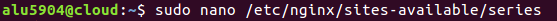

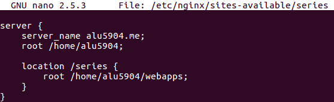

A continuación tenemos que enlazar el fichero que hemos creado para que esté disponible desde nginx en concreto desde los sites-enabled.

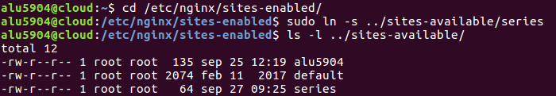

Tenemos que recargar la configuración de Nginx para que los cambios surtan efecto.

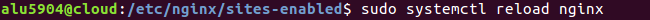

Por último, creamos una carpeta dentro de webapps de series donde irá nuestro index de nuestro host de series.

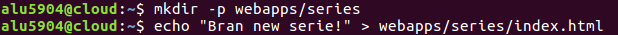

## 2. Fondo.

Descargamos algún fondo de la página web de Subtle Patterns, para ello lo descargamos en la máquina de desarrollo, luego utilizamos un comando y la copiamos en la máquina de producción.

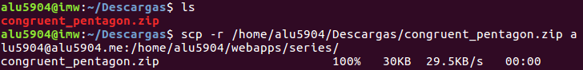

Instalamos unzip para poder descomprimir el archivo y luego lo descomprimimos.

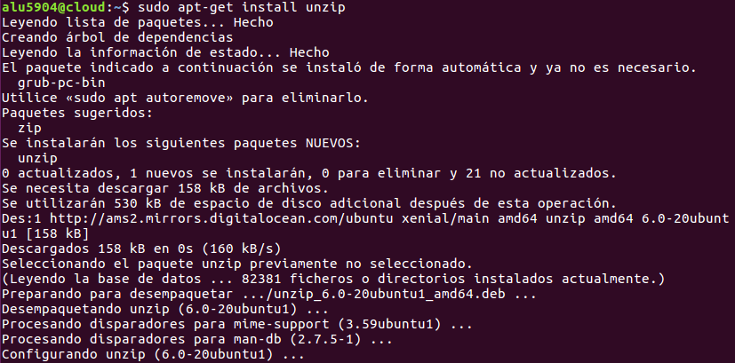

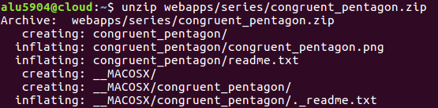

Finalmente comprobamos que se encuentra en nuestro directorio de series y dentro de nuestro archivo descomprimido vemos que se encuentra la imagen de fondo.

## 3. Imágenes.

Antes que nada para poder poner imágenes en nuestra máquina de producción creamos una carpeta para guardar todas las imágenes de portada de las series y el fondo.

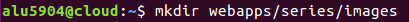

Volvemos a la máquina de desarrollo y descargamos todas las portadas de las series que he elegido. Luego las copia a mi máquina de producción.

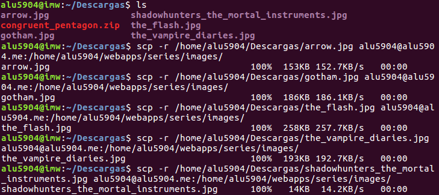

Finalmente comprobamos que las imágenes se encuentran en la carpeta de images.

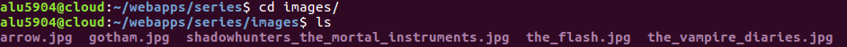

Copiamos el fondo y lo metemos también en esta carpeta de images.

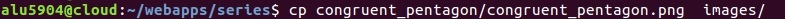

## 4. Mejoras Página Web.

Para mejorar la página web que he creado con mis 5 series favoritas, utilizo el nginx y edito un fichero de index.html para que se cree la página web.

Cada vez que vaya editando algo tengo que recargar el servicio de nginx.

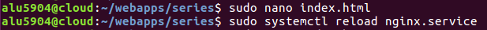

Después de trabajar en el fichero el código de html nos quedaría como en esta imagen.

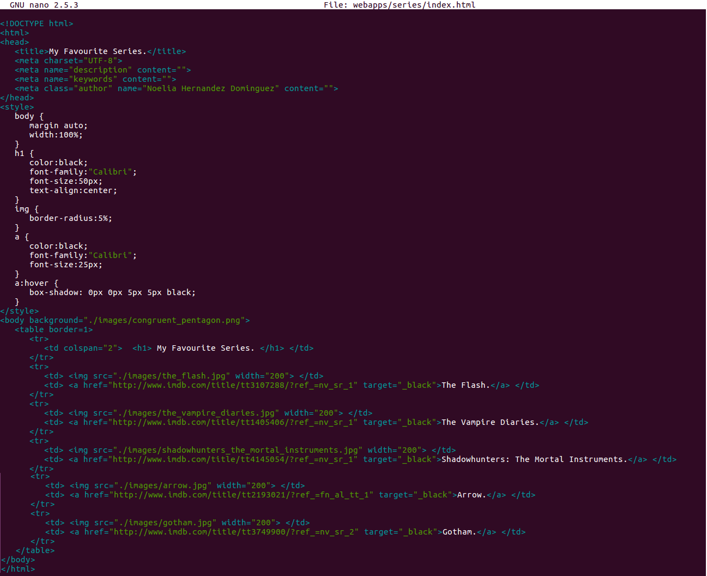

Finalmente la página web nos quedaría como se ve a continuación.

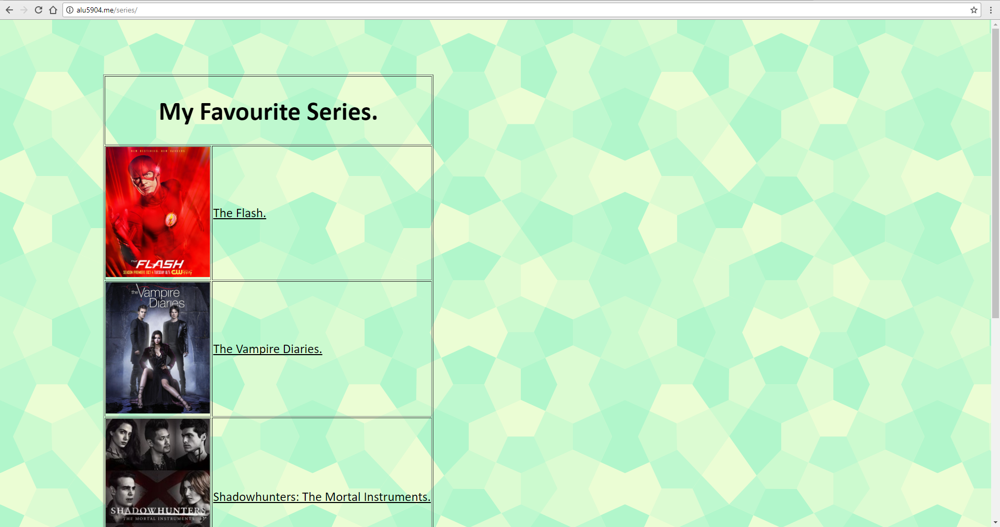
