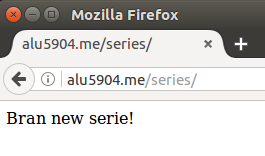
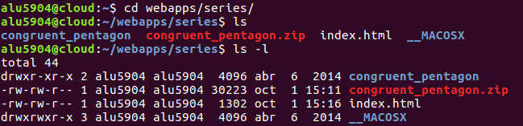
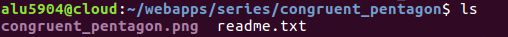
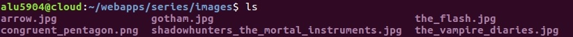

# **UT1 - A1 : Mis series favoritas.**

En esta actividad he creado una página web que enlaza con mis 5 series favoritas.

Para acceder a dicha página solo se tiene que pinchar en el siguiente enlace:

**[My Favourite Series](http://alu5904.me/series/).**

## **1. Creación Del Directorio Series.**

Lo que queremos realizar es que en nuestro home, donde tenemos nuestro usuario alu5904, tener un Virtual Host llamado series, el cual nos muestre cuando accedemos a **alu5904.me/series** nuestra web con nuestras 5 series favoritas.

Añadiremos el fichero de configuración de Nginx que tratará las peticiones que se hagan al nombre de dominio alu5904.me/series.

Creamos un fichero dentro de Nginx y en concreto en los sites-available, donde añadiremos la información para que se vaya creando el dominio.

A continuación tenemos que enlazar el fichero que hemos creado para que esté disponible desde Nginx, en concreto desde los sites-enabled.

Tenemos que recargar la configuración de Nginx para que los cambios surtan efecto.

Por último, creamos una carpeta dentro de webapps de series donde irá el index.html de nuestro Vitual Host de series.

## **2. Fondo.**

Descargamos el fondo que queramos de la página web de Subtle Patterns. Lo descargamos en la máquina de desarrollo, luego utilizamos el comando scp y lo copiamos en la máquina de producción.

Instalamos unzip para poder descomprimir el archivo y luego lo descomprimimos.

Finalmente comprobamos que se encuentra en nuestro directorio de series y dentro de nuestro archivo descomprimido vemos que se encuentra la imagen de fondo.

## **3. Imágenes.**

Antes que nada, para poder poner más imágenes en nuestra máquina de producción, creamos una carpeta para guardar todas las imágenes de las portadas de las series y el fondo anteriormente descargado.

Volvemos a la máquina de desarrollo y descargamos todas las portadas de las series que he elegido. Luego las copiamos a mi máquina de producción.

Comprobamos que las imágenes se encuentran en la carpeta de images.

Copiamos el fondo y lo metemos también en esta carpeta de images.

## **4. Página Web.**

Para mejorar la página web, que he creado con mis 5 series favoritas, utilizo el Nginx y edito el fichero de index.html para que se cree la página web.

Cada vez que vaya editando algo en el fichero tengo que recargar el servicio de Nginx.

Después de trabajar en el fichero el código html nos quedaría como en esta imagen.

Finalmente la página web nos quedaría como se ve a continuación.

