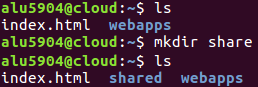
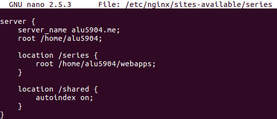
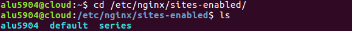
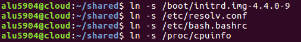
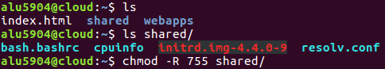
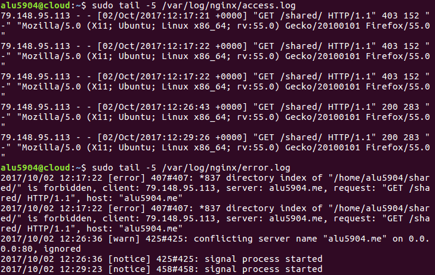
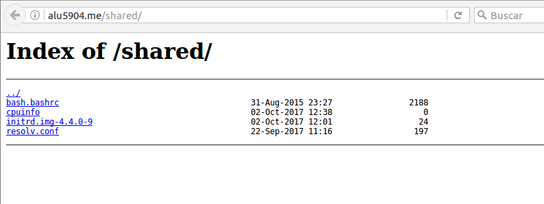

# **UT1 - A2 : Listado De Directorios.**

En esta actividad he creado una página web, la que contiene el acceso al contenido de un subdirectorio dentro de la ruta raíz de Nginx, enlazando una serie de ficheros desde ahí.

Para acceder a dicha página solo se tiene que pinchar en el siguiente enlace:

[Listado De Directorios.](http://alu5904.me/shared/)

## **1. Autoindex.**

Uno de los múltiples parámetros que se pueden configurar para los sitios web que se definen en Nginx es el autoindex y nos permite listar el contenido del directorio actual, pudiendo implementar una especie de FTP a través del navegador.

Supongamos que tenemos una carpeta shared en nuestro home que queremos compartir, para realizar esto vamos a ver cómo implementarlo usando Nginx.

Lo primero es crear nuestro directorio shared.

Creamos un fichero shared dentro de Nginx, en concreto en el que se creó en la actividad anterior, en el fichero de series, esto se encuentra en los sites-available, donde añadiremos la información de autoindex para que se vaya creando el dominio.

En este caso no tenemos que enlazar el fichero porque en la actividad anterior ya lo enlazamos en los sites-enabled.

Ahora tenemos que recargar la configuración de Nginx para que los cambios surtan efecto.

## **2. Enlaces Simbólicos.**

Ahora añadiremos algunas cosas en la carpeta que queremos compartir, por ejemplo, cuatro enlaces simbólicos que haremos de ficheros de nuestro sistema.

~~~~
/boot/initrd.img-4.4.0-9, la imagen del kernel.
/etc/resolv.conf, el listado de DNS.
/etc/bash.bashrc, la configuración global de bash.
/proc/cpuinfo, las características de la máquina.
~~~~

Ahora comprobamos que se encuentran dentro de nuestro home. También le damos privilegios a nuestro directorio shared de lectura, escritura y ejecución al propietario y a las demás personas de lectura y ejecución.

Es muy importante en estos casos comprobar los accesos y los errores que nos van ocurriendo en nuestro proceso de creación de Virtual Host y de sus location, para ello tenemos que mirar los ficheros log.

Finalmente nuestro autoindex nos quedaría como se ve a continuación.

