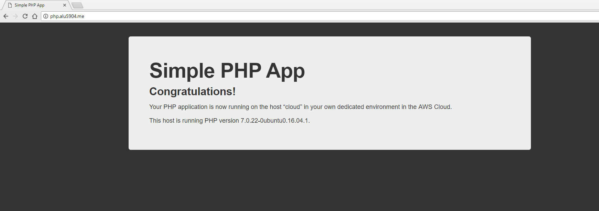
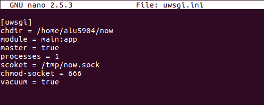
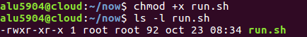
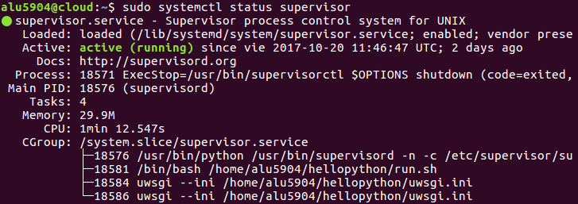
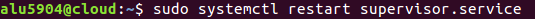
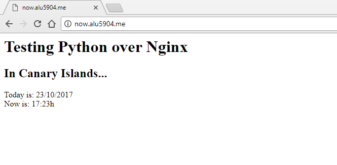

___

# **UT1. A4. Sirviendo Aplicaciones Php Y Python.**

La actividad consiste en configurar 2 sitios web, Virtual Hosts, en nuestro Servidor Web Nginx.

___

# **Sitio Web 1.**

* **http://php.alu5904.me.**

Tenemos que mostrar la aplicación demo_php.zip. Para ello descargamos demo_php.zip.

Copiamos el archivo comprimido demo_php.zip a la máquina de producción.

Descomprimimos el archivo demo_php.zip.

Comprobamos que se ha descomprimido el archivo.

Ahora lo que hacemos es añadir el fichero de configuración de Nginx que tratará las peticiones que se hagan al nombre de dominio php.alu5904.me. Para ello vamos a la ruta `/etc/nginx/sites-available/` y creamos el fichero demo.

Ahora añadimos el contenido a demo.

A continuación tenemos que enlazar el fichero que hemos creado para que esté disponible desde los sites-enabled. Para ello entramos a `/etc/nginx/sites-enabled`, hacemos un enlace simbólico y lo comprobamos.

Por último, tenemos que recargar la configuración de Nginx para que los cambios surtan efecto, para ello utilizamos el comando systemctl reload nginx.

Finalmente entramos desde un navegador a http://php.alu5904.me.

___

# **Sitio Web 2.**

* **http://now.alu5904.me.**

Creamos un nuevo entorno virtual.

Entramos dentro de nuestro entorno virtual.

Dentro de nuestro entorno virtual instalamos el paquete pytz.

Ahora dentro de nuestro entorno virtual creamos el directorio now.

Entramos dentro de este directorio y creamos el fichero main.py.

Ahora añadimos el siguiente contenido a main.py.

~~~
import datetime
import pytz
from flask import Flask
app = Flask(__name__)

@app.route("/")
def hello():
    now = datetime.datetime.now(pytz.timezone("Atlantic/Canary"))
    return """
    <h1>Testing Python over Nginx</h1>
    <h2>In Canary Islands...</h2>
    Today is: {today}
     
    Now is: {now}
    """.format(
        today=now.strftime("%d/%m/%Y"),
        now=now.strftime("%H:%Mh")
    )
~~~

Creamos un fichero de configuración para uWSGI.

Ahora añadimos el siguiente contenido a uwsgi.ini.

~~~
[uwsgi]
chdir = /home/alu5904/now
module = main:app
master = true
processes = 1
socket = /tmp/now.sock
chmod-socket = 666
vacuum = true
~~~

Ahora tenemos que crear un pequeño script que será el encargado de activar el entorno virtual de nuestra aplicación y de lanzar el proceso uwsgi para que escuche peticiones en el socket especificado.

Ahora añadimos el siguiente contenido a run.sh.

~~~
#!/bin/bash

source /home/alu5904/.virtualenvs/now/bin/activate
uwsgi --ini /home/alu5904/now/uwsgi.ini
~~~

Ahora le damos permisos de ejecución al script que hemos creado.

En este punto, podríamos lanzar el script run.sh sin tener que activar el entorno virtual previamente, ya que el propio script realiza esta tarea.

Ahora lo que hacemos es añadir el fichero de configuración de Nginx que tratará las peticiones que se hagan al nombre de dominio now.alu5904.me. Para ello vamos a la ruta `/etc/nginx/sites-available/` y creamos el fichero now.

Ahora añadimos el siguiente contenido a now.

~~~
server {
    server_name now.alu5904.me;

    location / {
        include uwsgi_params;
        uwsgi_pass unix:/tmp/now.sock;
    }

    location /static {
        root /home/alu5904/now;
    }
}
~~~

A continuación tenemos que enlazar el fichero que hemos creado para que esté disponible desde los sites-enabled. Para ello entramos a `/etc/nginx/sites-enabled`, hacemos un enlace simbólico y lo comprobamos.

Por último, tenemos que recargar la configuración de Nginx para que los cambios surtan efecto, para ello utilizamos el comando systemctl reload nginx.

Para mantener nuestra aplicación "viva" y poder gestionar su arranque/parada de manera sencilla, necesitamos un proceso coordinador. Para este cometido, se ha desarrollado supervisor.

Comprobamos que el servicio está funcionando.

Para que nuestro programa now sea gestionado por supervisor, debemos añadir un fichero de configuración.

Ahora añadimos el siguiente contenido a now.conf.

~~~
[program:now]
user = alu5904
command = /home/alu5904/now/run.sh
autostart = true
autorestart = true
stopsignal = INT
killasgroup = true
stderr_logfile = /home/alu5904/now/now.err.log
stdout_logfile = /home/alu5904/now/now.out.log
~~~

Reiniciamos el servicio del supervisor.

Comprobamos que el servicio está funcionando con normalidad.

Ahora, desde la máquina de producción, pero con un usuario no privilegiado, vemos que ya podemos hacer uso de la gestión de nuestros procesos.

En este punto, podemos probar los siguientes comandos.

~~~
* supervisorctl status
* supervisorctl start now
* supervisorctl stop now
* supervisorctl restart now
~~~

Finalmente entramos desde un navegador a http://now.alu5904.me.

---
