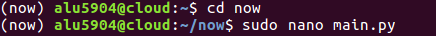

___

# **UT1. A4. Sirviendo Aplicaciones Php Y Python.**

La actividad consiste en configurar 4 sitios web, virtual hosts, en nuestro servidor web Nginx, con las siguientes características.

___

# **Sitio Web 1.**

* **http://php.alu5904.me.**

Tenemos que mostrar la aplicación demo_php.zip. Para ello descargamos demo_php.zip.

Copiamos el archivo comprimido demo_php.zip a la máquina de producción.

Descomprimimos el archivo demo_php.zip.

Comprobamos que se a descomprimido el archivo.

Ahora lo que hacemos es añadir el fichero de configuración de Nginx que tratará las peticiones que se hagan al nombre de dominio php.alu5904.me. Para ello vamos a la ruta /etc/nginx/sites-available/ y creamos el fichero demo.

Ahora añadimos el contenido a demo.

A continuación tenemos que enlazar el fichero que hemos creado para que esté disponible desde los sites-enabled. Para ello entramos a /etc/nginx/sites-enabled, hacemos un enlace simbólico y lo comprobamos.

Por último, tenemos que recargar la configuración de Nginx para que los cambios surtan efecto, para ello utilizamos el comando systemctl reload nginx.

Finalmente entramos desde un navegador a http://php.alu5904.me.

___

# **Sitio Web 2.**

* **http://now.alu5904.me.**

Creamos un nuevo entorno virtual.

 > mkdir .virtualenvs , virtualenv .virtualenvs/now

Entramos dentro de nuestro entorno virtual.

 > source .virtualenvs/hellopython/bin/activate

Ahora dentro de nuestro entorno virtual creamos el directorio now.

 > mkdir hellopython

Entramos dentro de este directorio y creamos el fichero main.py.

 > cd hellopython , nano main.py

Ahora añadimos el siguiente contenido a main.py.

~~~
import datetime
from flask import Flask
app = Flask(__name__)

@app.route("/")
def hello():
    return """
    <h1>Testing Python over Nginx</h1>
    Today is: {today}
     
    Now is: {now}
    """.format(
        today=datetime.datetime.now().strftime("%d/%m/%Y"),
        now=datetime.datetime.now().strftime("%H:%mh")
    )
~~~

Ahora lanzamos el proceso que escuchará peticiones.

 > uwsgi --socket 0.0.0.0:8080 --protocol=http -w main:app

Vamos a un navegador y ponemos http://alu5904.me:8080.

Creamos un fichero de configuración para uWSGI.

 > nano uwsgi.ini

Ahora añadimos el siguiente contenido a uwsgi.ini.

~~~
[uwsgi]
chdir = /home/alu5904/now
module = main:app
master = true
processes = 1
socket = /tmp/now.sock
chmod-socket = 666
vacuum = true
~~~

Ahora tenemos que crear un pequeño script que será el encargado de activar el entorno virtual de nuestra aplicación y de lanzar el proceso uwsgi para que escuche peticiones en el socket especificado.

 > nano run.sh

Ahora añadimos el siguiente contenido a run.sh.

~~~
#!/bin/bash

source /home/alu5904/.virtualenvs/now/bin/activate
uwsgi --ini /home/alu5904/now/uwsgi.ini
~~~

Ahora le damos permisos de ejecución al script que hemos creado.

 > chmod +x run.sh , ls -l run.sh

En este punto, podríamos lanzar el script run.sh sin tener que activar el entorno virtual previamente, ya que el propio script realiza esta tarea.

 > ./run.sh

Vamos a crear un virtual host para nuestra aplicación python. Queremos que responda a peticiones a la url http://now.imwpto.me. Para ello haremos lo siguiente.

 > sudo nano /etc/nginx/sites-available/now

Ahora añadimos el siguiente contenido a now.

~~~
server {
    server_name now.alu5904.me;

    location / {
        include uwsgi_params;
        uwsgi_pass unix:/tmp/now.sock;
    }

    location /static {
        root /home/alu5904/now;
    }
}
~~~

Enlazamos el virtual host para habilitarlo.

 > cd /etc/nginx/sites-enabled/ , sudo ln -s ../sites-available/hellopython , ls -l

Ahora recargamos el servidor web. > sudo systemctl reload nginx

En este momento, las peticiones que lleguen a nuestro servidor Nginx en la url definida serán derivados a un servicio que debería estar escuchando en el socket /tmp/now.sock. Si probamos a acceder en este momento a nuestro servidor web, nos aparece lo siguiente, mientras tanto tenemos que dejar el run.sh ejecutandose. (Se debe a que nos falta lanzar nuestra aplicación uWSGI para que escuche en el socket especificado y devuelva el sencillo html que hemos preparado en nuestra aplicación python, Sin parar de ejecutar el comando anterior, volvemos a probar el acceso a través del navegador, y obtenemos lo siguiente)

Para mantener nuestra aplicación "viva" y poder gestionar su arranque/parada de manera sencilla, necesitamos un proceso coordinador. Para este cometido, se ha desarrollado supervisor.

Comprobamos que el servicio está correctamente instalado y funcionando:

 > sudo systemctl status supervisor

Para que nuestro programa hellopython sea gestionado por supervisor, debemos añadir un fichero de configuración:

 > sudo vi /etc/supervisor/conf.d/now.conf

Ahora añadimos el siguiente contenido a now.conf.

~~~
[program:hellopython]
user = sdelquin
command = /home/alu5904/now/run.sh
autostart = true
autorestart = true
stopsignal = INT
killasgroup = true
stderr_logfile = /home/alu5904/now/now.err.log
stdout_logfile = /home/alu5904/now/now.out.log
~~~

Permitimos la gestión de procesos por usuarios no privilegiados. Revisamos el estado del servicio del supervisor.

 > supervisorctl status

Reiniciamos el servicio del supervisor.

 > sudo systemctl restart supervisor

Comprobamos que el servicio está funcionando con normalidad:

 > sudo systemctl status supervisor

Ahora, desde la máquina de producción, pero con un usuario no privilegiado, vemos que ya podemos hacer uso de la gestión de nuestros procesos:

 > supervisorctl status

En este punto, podemos comprobar que el acceso a la aplicación está funcionando:

 > supervisorctl status

 > sdelquin@cloud:~$ supervisorctl stop now

 > supervisorctl status now

 > supervisorctl start now

 > supervisorctl status now

 > supervisorctl restart now

 > supervisorctl status hellopython

Finalmente entramos desde un navegador a http://php.alu5904.me.

---
