___

# **UT4 - A1: Implantación De Wordpress.**

---

## **1. Instalación de Wordpress.**

Vamos a instalar un sitio web Wordpress en nuestra máquina. Para ello accedemos a la máquina de producción vía ssh.

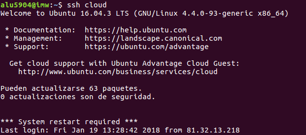

Wordpress necesita un usuario y una contraseña para acceder a una base de datos. Para ello, usaremos el intérprete de MySQL.

Tenemos que crear la base de datos, el usuario y asignar privilegios.

Descargamos el código fuente de Wordpress desde su página web.

Descomprimimos el código y lo copiamos en `/usr/share`.

Ahora tenemos que establecer los permisos necesarios para que el usuario web www-data pueda usar estos ficheros.

Debemos especificar el nombre de la base de datos, el usuario y la contraseña, para que Wordpress pueda usarlos.

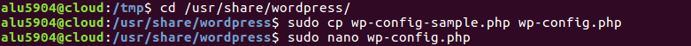

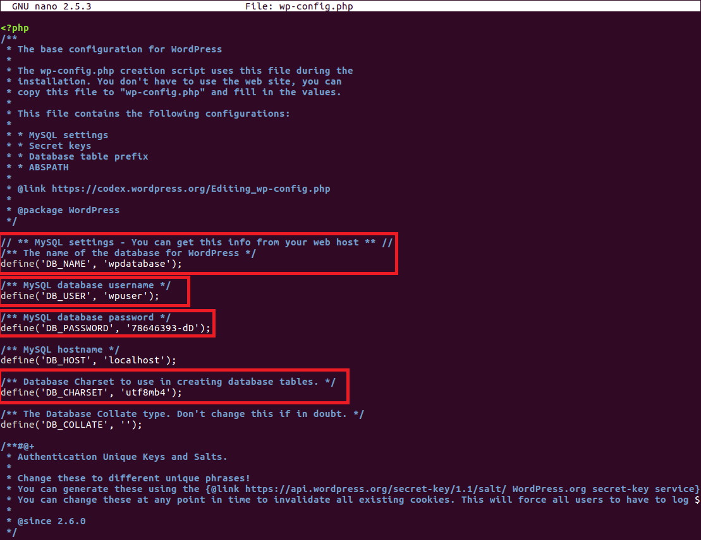

Para que nuestro sitio Wordpress sea accesible desde un navegador web, debemos incluir las directivas necesarias en la configuración del Servidor web Nginx.

Queremos acceder a nuestro Wordpress desde la url `wordpress.alu5904.me`. Para ello tendremos que crear un nuevo virtual host de la siguiente manera.

Enlazamos la configuración para que el virtual host esté disponible.

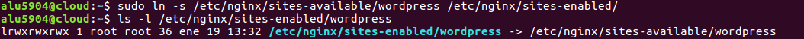

Recargamos el Servidor web Nginx para que los cambios sean efectivos.

Ahora podemos acceder a la dirección de nuestro servidor para configurar nuestro Wordpress vía web.

Cuando accedemos a `http://wordpress.alu5904.me` nos redirige a `http://wordpress.alu5904.me/wp-admin/install.php`.

Elegimos el idioma Español y le damos a Continuar.

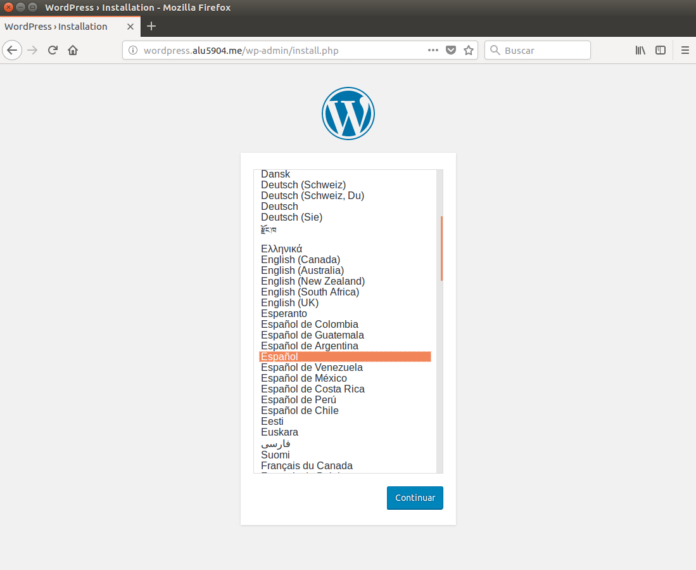

Rellenamos los campos que nos piden y pulsamos Instalar Wordpress.

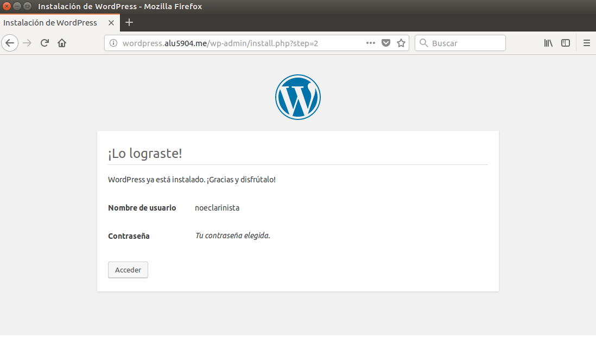

Pulsamos en el botón Acceder e ingresamos nuestras credenciales.

Así habremos podido acceder a la interfaz administrativa de Wordpress.

---

## **2. Instalación Y Activación De Un Tema.**

Instalamos y activamos un tema gratuito.

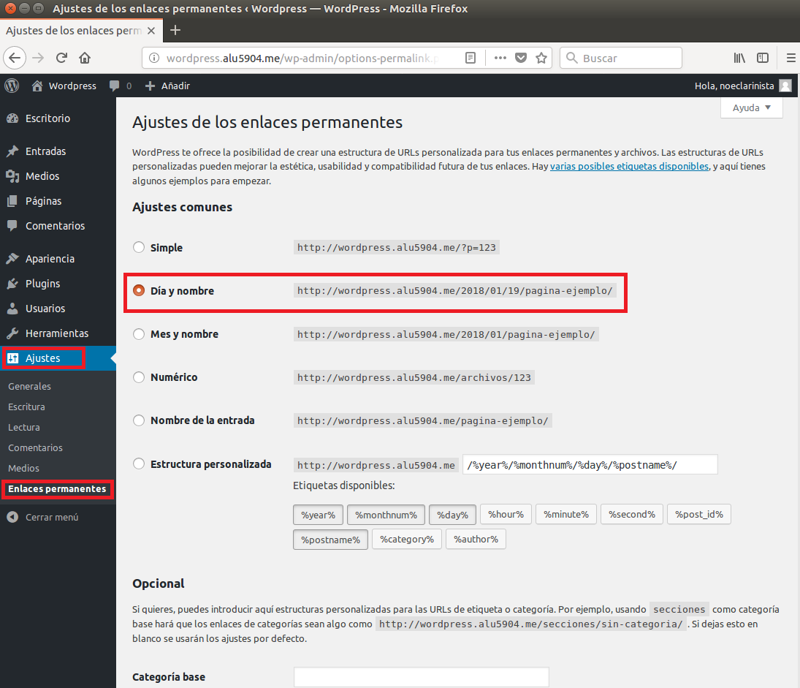

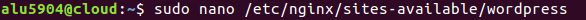

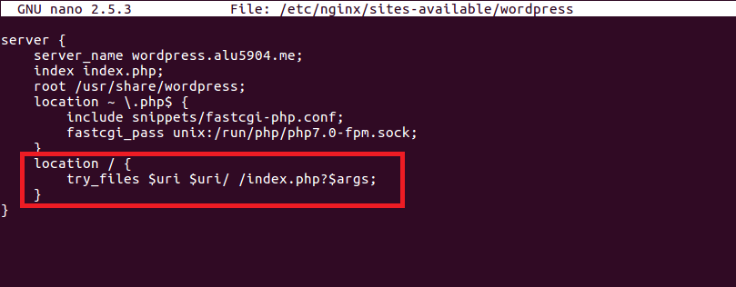

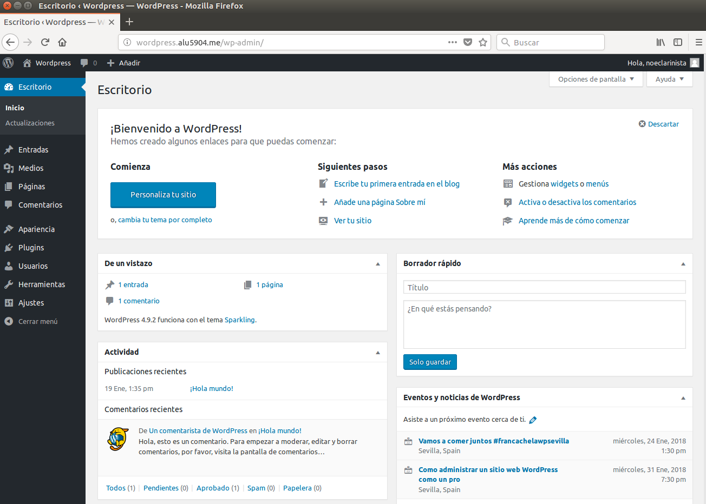

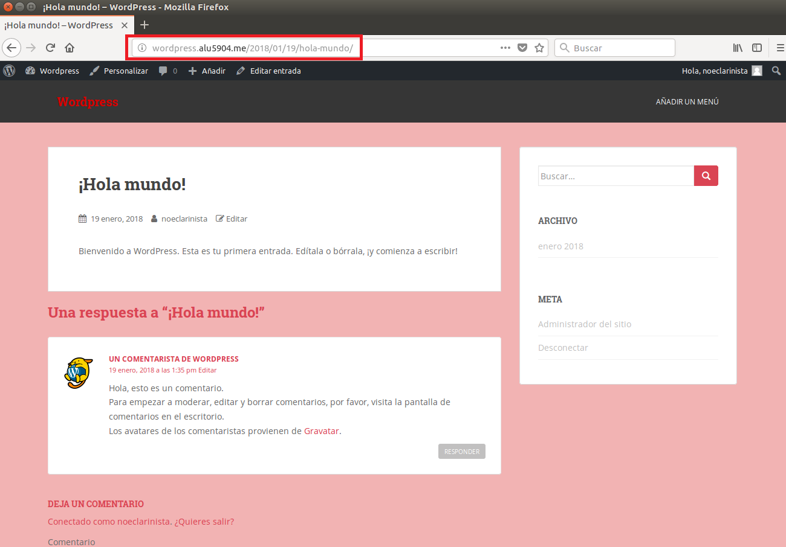

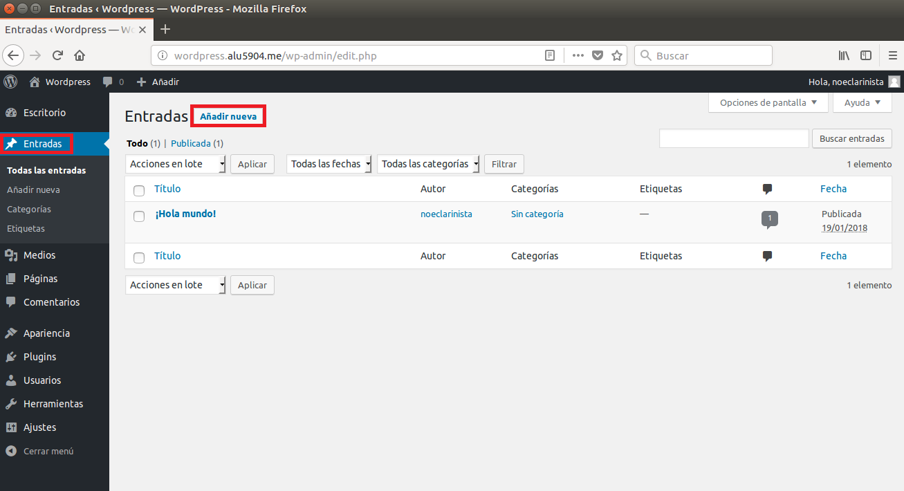

---

## **3. Ajuste De Permalinks.**

En primer lugar activamos esta opción dentro de la interfaz administrativa de Wordpress.

Seleccionamos el ajuste Día y nombre. Pulsamos en Guardar cambios.

Ahora debemos indicar a Nginx que procese estas URLs.

~~~
location / {
    try_files $uri $uri/ /index.php?$args;
}
~~~

No olvidarnos de recargar la configuración de Nginx:

Una ventaja que tiene este método es que podemos acceder a la zona administrativa utilizando la siguiente URL. http://wordpress.imwpto.me/admin

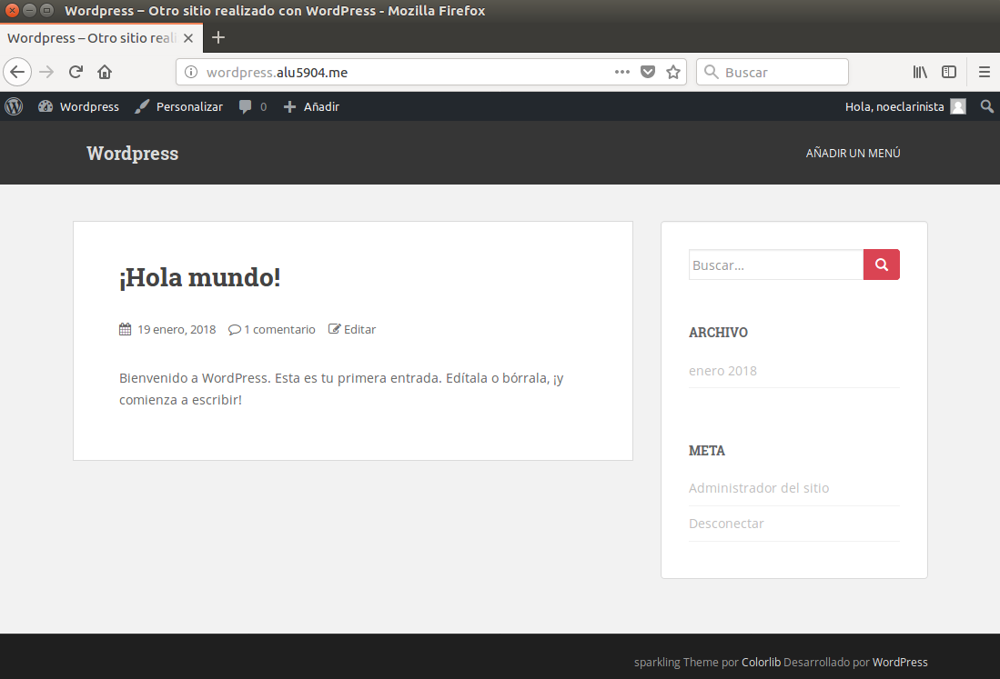

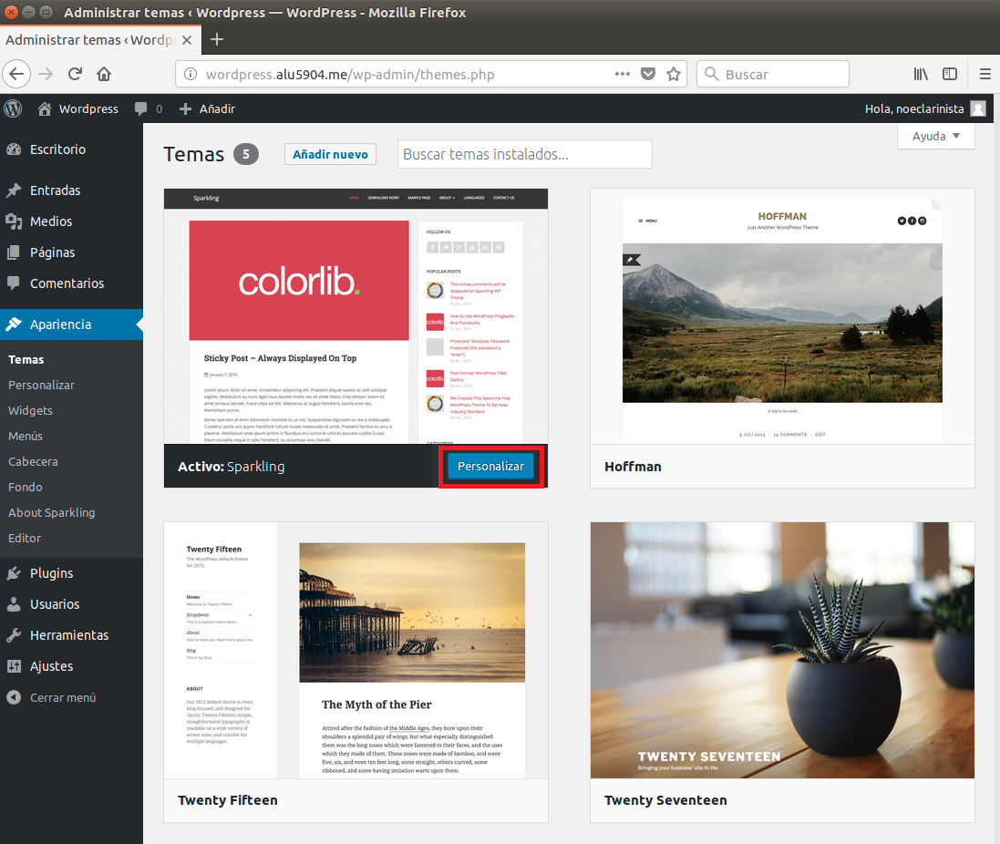

---

## **4. Post Con Las Estadísticas De Uso De Wordpress.**

Escribimos un post con las estadísticas de uso de Wordpress.

Entramos a dicho post.

---
